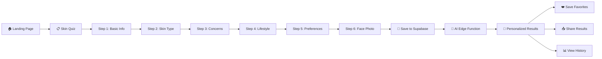

<div align="center">

# 🌿 SkinWise Advisor

### AI-Powered Personalized Skincare Recommendation Platform

[](https://react.dev/)
[](https://www.typescriptlang.org/)
[](https://supabase.com/)
[](https://tailwindcss.com/)
[](https://vite.dev/)
[](https://ui.shadcn.com/)

Take a quick skin assessment quiz, optionally capture a face photo for visual AI analysis, and receive **personalized product recommendations** powered by AI — all tailored to the Indian skincare market with real products, real brands, and budget-aware suggestions.

[Features](#-features) · [How It Works](#-how-it-works) · [Tech Stack](#-tech-stack) · [Getting Started](#-getting-started) · [Database Schema](#-database-schema) · [Project Structure](#-project-structure)

</div>

---

## ✨ Features

### 🧪 Smart Skin Assessment Quiz
- **6-Step guided quiz** collecting comprehensive skin data:
  - **Basic Info** — Age range & gender
  - **Skin Type** — Oily, Dry, Combination, Sensitive, or Normal
  - **Skin Concerns** — Multi-select from acne, dark spots, wrinkles, pigmentation, dullness, and more
  - **Lifestyle** — Climate, allergies & sensitivities
  - **Preferences** — Skin goals & budget range (₹Budget / ₹Mid / ₹Premium / ₹Luxury)
  - **Face Photo** *(optional)* — Capture or upload a photo for visual AI skin analysis
- **Progress indicator** with step validation ensuring data completeness
- **Allergy awareness** — AI avoids recommending products with flagged ingredients

### 🤖 AI-Powered Product Recommendations
- **Gemini AI integration** via Supabase Edge Functions for intelligent product matching
- **Visual skin analysis** — When a face photo is provided, AI examines visible conditions (acne, redness, dryness, texture issues)
- **5 real product recommendations** per assessment from Indian brands like Minimalist, Dot & Key, Plum, Mamaearth, The Derma Co, Cetaphil, etc.
- Each recommendation includes:
  - Product name & brand
  - Key ingredients breakdown
  - Why it's suitable for your skin
  - Usage instructions
  - Safety warnings & allergen alerts
  - Price range & purchase links
- **Budget-aware** — Recommendations respect your price tier (₹0–500, ₹500–1500, ₹1500–3000, ₹3000+)
- **AI summary** — A personalized skincare routine overview

### 📸 Face Capture & Detection
- **Real-time webcam face detection** using TensorFlow.js BlazeFace model
- **Face bounding box overlay** for guided photo capture
- **File upload fallback** — Upload an existing photo if camera isn't available
- **Auto face detection validation** — Ensures a face is detected before capture
- **Privacy-first** — Face photos are processed by AI but never stored on servers

### 📊 Assessment History
- **Full history** of all past skin assessments with timestamps
- **Expandable details** — View assessment parameters and product recommendations for each entry
- **Re-generate recommendations** — Refresh AI recommendations for any past assessment
- **Delete assessments** — Remove individual entries or clear entire history
- **Product count indicators** — Quickly see how many products were recommended per assessment

### ❤️ Favorites System
- **Favorite products** from any recommendation with a single click
- **Dedicated Favorites page** — Browse all saved products in one place
- **Persistent favorites** stored in Supabase, synced across devices
- **Un-favorite** products anytime

### 👤 User Profiles & Authentication
- **Supabase Auth** with email/password registration and login
- **User profiles** with full name and email management
- **Protected routes** — Quiz, Results, History, and Favorites require authentication
- **Session persistence** — Stay logged in across browser sessions

### 🎨 UI/UX
- **🌗 Dark/Light mode** with system preference detection and manual toggle
- **Responsive design** — Fully mobile-friendly with touch-optimized interactions
- **shadcn/ui component library** — Polished, accessible UI components built on Radix UI
- **Toast notifications** — Elegant feedback for all user actions
- **Share results** — Share your product recommendations via native Web Share API
- **Product feedback** — Rate individual product recommendations

---

## 🔄 How It Works



1. **User signs up/logs in** via Supabase Auth
2. **Takes the 6-step quiz** — entering skin type, concerns, allergies, budget, and optionally a face photo
3. **Assessment is saved** to the `skin_assessments` table in Supabase
4. **Supabase Edge Function** (`get-recommendations`) is invoked, which sends the profile + face photo to Gemini AI
5. **AI generates 5 product recommendations** with detailed info, stored in the `recommendations` table
6. **User views results**, can favorite products, share results, or provide feedback
7. **History page** shows all past assessments with their recommendations

---

## 🛠️ Tech Stack

### Frontend
| Technology | Purpose |
|---|---|
| **React 19** | UI library with modern hooks |
| **TypeScript 5.6** | Type-safe development |
| **Vite 8** | Lightning-fast dev server & build tool |
| **React Router DOM 7** | Client-side routing & navigation |
| **Tailwind CSS** | Utility-first CSS framework |
| **shadcn/ui** | Accessible component library (40+ Radix UI components) |
| **TanStack React Query** | Server state management & data fetching |
| **Lucide React** | Beautiful icon library |
| **React Hook Form + Zod** | Form management with schema validation |
| **Recharts** | Data visualization charts |

### Backend (Supabase)
| Technology | Purpose |
|---|---|
| **Supabase Auth** | Email/password authentication & session management |
| **Supabase Database** (PostgreSQL) | User profiles, assessments, recommendations, favorites |
| **Supabase Edge Functions** (Deno) | Serverless AI recommendation engine |
| **Row Level Security (RLS)** | Per-user data isolation at the database level |

### AI & Computer Vision
| Technology | Purpose |
|---|---|
| **Google Gemini AI** | Skincare product recommendation intelligence |
| **TensorFlow.js** | Client-side face detection (BlazeFace model) |
| **@tensorflow-models/blazeface** | Real-time face bounding box detection |

---

## 🚀 Getting Started

### Prerequisites

- **Node.js** v18+ (or **Bun**)
- A **Supabase** project ([create one free](https://supabase.com/dashboard))
- A **Gemini API Key** (set as `LOVABLE_API_KEY` in Supabase Edge Function secrets)

### 1. Clone the Repository

```bash
git clone https://github.com/Sjjcnr/skinwise-advisor-7bee6e3c.git
cd skinwise-advisor-7bee6e3c
```

### 2. Install Dependencies

```bash
npm install
# or
bun install
```

### 3. Set Up Environment Variables

Create a `.env` file in the root:

```env
VITE_SUPABASE_URL=https://your-project.supabase.co
VITE_SUPABASE_ANON_KEY=your-anon-key-here
```

### 4. Set Up Supabase

1. **Create a Supabase project** at [supabase.com](https://supabase.com)
2. **Run the migrations** — Apply the SQL files in `supabase/migrations/` to set up the database schema:
   - `profiles` — User profile data
   - `skin_assessments` — Quiz assessment data
   - `recommendations` — AI-generated product recommendations
   - `favorites` — Favorited products
   - `product_feedback` — User product ratings
3. **Deploy the Edge Function**:
   ```bash
   supabase functions deploy get-recommendations
   ```
4. **Set secrets** for the Edge Function:
   ```bash
   supabase secrets set LOVABLE_API_KEY=your-gemini-api-key
   ```

### 5. Run the Application

```bash
npm run dev
# or
bun run dev
```

Open [http://localhost:5173](http://localhost:5173) in your browser.

### 6. Build for Production

```bash
npm run build
npm run preview
```

---

## 🗃️ Database Schema

### `profiles`
| Column | Type | Description |
|--------|------|-------------|
| `id` | UUID (PK) | Auto-generated |
| `user_id` | UUID (FK → auth.users) | Supabase auth user reference |
| `email` | TEXT | User email |
| `full_name` | TEXT | Display name |
| `created_at` | TIMESTAMPTZ | Account creation time |
| `updated_at` | TIMESTAMPTZ | Last profile update |

### `skin_assessments`
| Column | Type | Description |
|--------|------|-------------|
| `id` | UUID (PK) | Auto-generated |
| `user_id` | UUID (FK → auth.users) | Assessment owner |
| `age_range` | TEXT | e.g., "18-24", "25-34" |
| `gender` | TEXT | User gender |
| `skin_type` | TEXT | oily / dry / combination / sensitive / normal |
| `skin_concerns` | TEXT[] | Array of concerns (acne, wrinkles, etc.) |
| `climate` | TEXT | User's climate environment |
| `allergies` | TEXT[] | Known allergens/ingredients to avoid |
| `skin_goals` | TEXT | What the user wants to achieve |
| `budget_range` | TEXT | budget / mid / premium / luxury |
| `created_at` | TIMESTAMPTZ | When assessment was taken |

### `recommendations`
| Column | Type | Description |
|--------|------|-------------|
| `id` | UUID (PK) | Auto-generated |
| `assessment_id` | UUID (FK → skin_assessments) | Linked assessment |
| `user_id` | UUID (FK → auth.users) | Recommendation owner |
| `products` | JSONB | Array of 5 product objects |
| `ai_summary` | TEXT | AI-generated skincare routine summary |
| `created_at` | TIMESTAMPTZ | Generation timestamp |

### `favorites`
| Column | Type | Description |
|--------|------|-------------|
| `id` | UUID (PK) | Auto-generated |
| `user_id` | UUID (FK → auth.users) | User who favorited |
| `recommendation_id` | UUID (FK) | Source recommendation |
| `product_data` | JSONB | Snapshot of the favorited product |
| `created_at` | TIMESTAMPTZ | When favorited |

### `product_feedback`
| Column | Type | Description |
|--------|------|-------------|
| `id` | UUID (PK) | Auto-generated |
| `user_id` | UUID (FK → auth.users) | Feedback author |
| `recommendation_id` | UUID (FK) | Source recommendation |
| `product_name` | TEXT | Name of the reviewed product |
| `rating` | INTEGER | User rating |
| `feedback` | TEXT | Written feedback |
| `created_at` | TIMESTAMPTZ | Submission time |

> All tables use **Row Level Security (RLS)** — users can only access their own data.

---

## 📁 Project Structure

```
skinwise-advisor-7bee6e3c/
├── index.html                    # Vite entry HTML
├── package.json                  # Dependencies & scripts
├── vite.config.ts                # Vite configuration
├── tailwind.config.ts            # Tailwind CSS theme & plugins
├── tsconfig.json                 # TypeScript configuration
├── components.json               # shadcn/ui configuration
├── postcss.config.js             # PostCSS configuration
│
├── public/
│   ├── favicon.ico
│   └── robots.txt
│
├── src/
│   ├── main.tsx                  # React entry point
│   ├── App.tsx                   # Root component with routing
│   ├── App.css                   # Global app styles
│   ├── index.css                 # Tailwind imports & CSS variables
│   ├── vite-env.d.ts             # Vite type declarations
│   │
│   ├── types/
│   │   └── skincare.ts           # TypeScript interfaces (SkinAssessment, Product, Recommendation)
│   │
│   ├── contexts/
│   │   └── AuthContext.tsx        # Supabase auth context provider
│   │
│   ├── hooks/
│   │   ├── useAssessment.ts      # Quiz state management & step validation
│   │   ├── useFaceDetection.ts   # TensorFlow.js BlazeFace face detection
│   │   ├── use-mobile.tsx        # Responsive breakpoint detection
│   │   └── use-toast.ts          # Toast notification state
│   │
│   ├── integrations/
│   │   └── supabase/
│   │       ├── client.ts         # Supabase client initialization
│   │       └── types.ts          # Auto-generated Supabase database types
│   │
│   ├── lib/
│   │   └── utils.ts              # Utility functions (cn helper for Tailwind)
│   │
│   ├── pages/
│   │   ├── Index.tsx             # Landing page with features & CTA
│   │   ├── Auth.tsx              # Login & Registration (tab-based)
│   │   ├── Quiz.tsx              # 6-step skin assessment wizard
│   │   ├── Results.tsx           # AI recommendation results display
│   │   ├── History.tsx           # Past assessments & recommendations
│   │   ├── Favorites.tsx         # Saved favorite products
│   │   ├── Profile.tsx           # User profile management
│   │   ├── FaceCapturePage.tsx   # Dedicated face capture page
│   │   └── NotFound.tsx          # 404 page
│   │
│   ├── components/
│   │   ├── FaceCapture.tsx       # Webcam face detection & capture component
│   │   ├── FavoriteButton.tsx    # Heart toggle for favoriting products
│   │   ├── ShareButton.tsx       # Native Web Share API integration
│   │   ├── ProductFeedback.tsx   # Star rating & feedback form for products
│   │   ├── NavLink.tsx           # Navigation link component
│   │   ├── ThemeProvider.tsx     # Dark/light theme context
│   │   ├── ThemeToggle.tsx       # Theme switcher button
│   │   │
│   │   ├── quiz/                 # Quiz step components
│   │   │   ├── ProgressIndicator.tsx
│   │   │   ├── StepBasicInfo.tsx
│   │   │   ├── StepSkinType.tsx
│   │   │   ├── StepConcerns.tsx
│   │   │   ├── StepLifestyle.tsx
│   │   │   ├── StepPreferences.tsx
│   │   │   └── StepFacePhoto.tsx
│   │   │
│   │   └── ui/                   # shadcn/ui components (40+ components)
│   │       ├── button.tsx
│   │       ├── card.tsx
│   │       ├── dialog.tsx
│   │       ├── toast.tsx
│   │       └── ... (accordion, badge, form, input, select, tabs, etc.)
│   │
│   └── ...
│
└── supabase/
    ├── config.toml               # Supabase project config
    ├── functions/
    │   └── get-recommendations/
    │       └── index.ts          # Edge Function: AI recommendation engine
    └── migrations/               # Database schema migrations
        ├── 20251226..._initial.sql
        ├── 20251228..._updates.sql
        ├── 20251230..._updates.sql
        ├── 20260308..._updates.sql
        └── 20260319..._updates.sql
```

---

## 🔑 Environment Variables

| Variable | Required | Description |
|----------|----------|-------------|
| `VITE_SUPABASE_URL` | **Yes** | Your Supabase project URL |
| `VITE_SUPABASE_ANON_KEY` | **Yes** | Supabase anonymous/public API key |

### Supabase Edge Function Secrets

| Secret | Required | Description |
|--------|----------|-------------|
| `LOVABLE_API_KEY` | **Yes** | Google Gemini API key for AI recommendations |
| `SUPABASE_URL` | Auto | Automatically available in Edge Functions |
| `SUPABASE_ANON_KEY` | Auto | Automatically available in Edge Functions |

---

## 🤝 Contributing

Contributions are welcome! Feel free to open an issue or submit a pull request.

1. Fork the repository
2. Create your feature branch (`git checkout -b feature/amazing-feature`)
3. Commit your changes (`git commit -m 'Add amazing feature'`)
4. Push to the branch (`git push origin feature/amazing-feature`)
5. Open a Pull Request

---

## 📄 License

This project is licensed under the **ISC License**.

---

<div align="center">

**Built with ❤️ using React, TypeScript, Supabase, Tailwind CSS, shadcn/ui, and Google Gemini AI**

</div>
